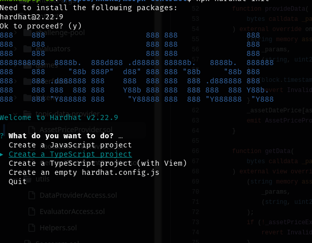
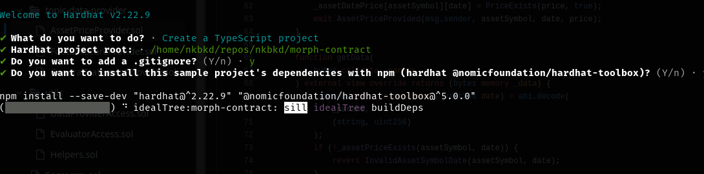
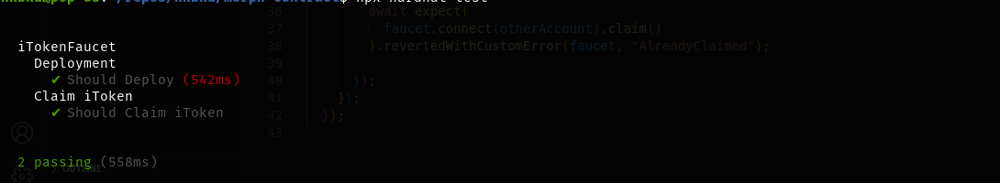
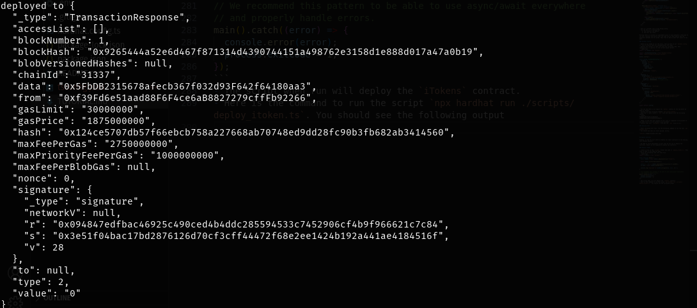
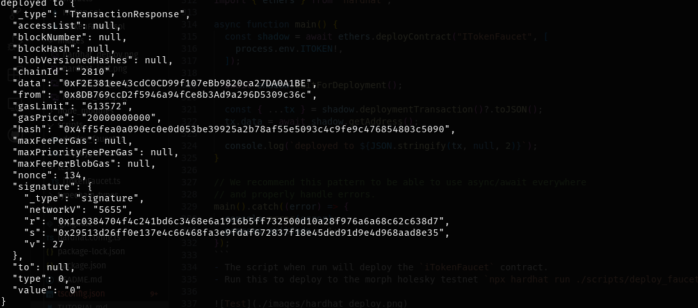
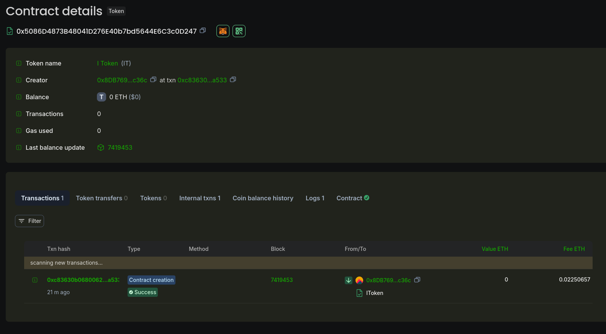
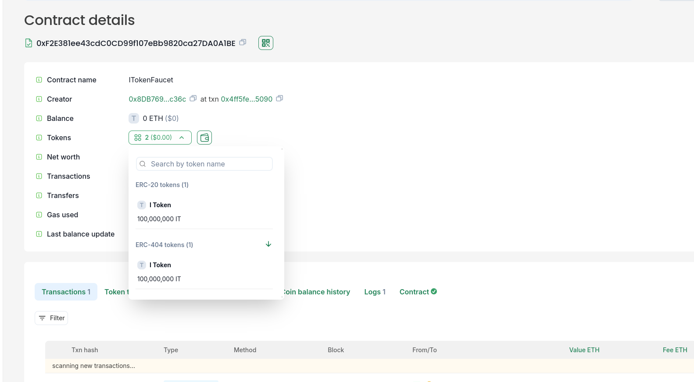

## Pre-Requisites

For the tutorial, we will use [Hardhat](https://hardhat.org) with Typescript for the Smart Contract. 

## Project Initialization

Open your terminal and perform the following steps;

- Create a project folder. Example command `mkdir morphme`
- Enter the folder you just created `cd morphme`
- To initialize the project run the following command `npx hardhat init`

This will initialize your smart contract repo with hardhat. You will see the following screen



Use the down arrow key to get to Typescript and hit enter. You will be asked several questions, just answer `yes`.



Wait for the installation to complete and open the folder in your code editor.


### Project Structure

Hardhat projects have 3 main folders to pay attention to.

- `contracts` folder which contains your solidity contracts.
- `test` folder which contains tests for your contracts.
- `scripts` folder which contains custom scripts you can use for things like contract deployment. Create this folder if it doesn't exist.

Aside these, one important file to take note of is the `hardhat.config.ts` file which contains configuration for private keys and blockchain networks.

Hardhat also creates some default files in these folders for you `Lock.sol` in contracts folder and `Lock.ts` in tests folder. You can go ahead and delete them since we are now going to replace with our own contracts.


## Writing your Contract

We want to launch our token on testnet and create a faucet that will allow our users to request a fixed amount of the token daily. For that we will code and launch two smart contracts.

- An ERC20 compliant token from the openzeplin library. We will call this token `iToken`.
- A faucet smart contract that allows any account to request a fixed amount of the token daily called `iTokenFaucet`.


### iToken

For this we will inherit ERC20 contract from openzepplin library.

- Install openzepplin using the following command `npm install @openzeppelin/contracts`.
- Create `iToken.sol` contract file in the `contracts` folder and paste the following code.

```solidity
// contracts/GLDToken.sol
// SPDX-License-Identifier: MIT
pragma solidity ^0.8.26;

import {ERC20} from "@openzeppelin/contracts/token/ERC20/ERC20.sol";
import {ERC20Permit} from "@openzeppelin/contracts/token/ERC20/extensions/ERC20Permit.sol";

contract IToken is ERC20, ERC20Permit {
    constructor() ERC20("I Token", "IT") ERC20Permit("I Token") {
        _mint(_msgSender(), 1_000_000_000 * 1e18);
    }
}
```

- This code inherits from the openzepplin ERC20 libarary and creates a contracts that will mint 1 billion woth of `iTokens` upon deployment.

Next we create our token faucet contract.

### iTokenFaucet

This is a simple but interesting contract that allows any account to request a fixed amount of `iTokens` from it daily.

- Create `iTokenFaucet.sol` contract file in the `contracts` folder and paste the following code.

```solidity
// contracts/GLDToken.sol
// SPDX-License-Identifier: MIT
pragma solidity ^0.8.26;

import "@openzeppelin/contracts/token/ERC20/IERC20.sol";
import "@openzeppelin/contracts/access/Ownable.sol";
import "@openzeppelin/contracts/token/ERC20/utils/SafeERC20.sol";

contract ITokenFaucet is Ownable {
    uint256 public dailyClaim = 1000 * 1e18;

    uint256 public claimInterval = 1 days;

    mapping(address => uint256) public lastClaimed;

    IERC20 public iToken;
    constructor(address _iAddress) Ownable(msg.sender) {
        iToken = IERC20(_iAddress);
    }

    error AlreadyClaimed();

    event Claimed(address _cliamer, uint256 _amount);

    function claim() external {
        if ((block.timestamp - lastClaimed[msg.sender]) < claimInterval) {
            revert AlreadyClaimed();
        }
        lastClaimed[msg.sender] = block.timestamp;
        SafeERC20.safeTransfer(iToken, msg.sender, dailyClaim);
        emit Claimed(msg.sender, dailyClaim);
    }

    function drain() external onlyOwner {
        SafeERC20.safeTransfer(iToken, owner(), iToken.balanceOf(address(this)));
    }
}
```

- This also imports some contracts from openzepplin to ensure we are using secure and audited code.
- It is a good practice to use already battle tested smart contracts whenever you can.
- Aside the imports we wrote our smart contract with two main methods `claim` and `drain`.
- `claim` can be called by anyone to claim their daily dose of the `iToken`. It's configured to `1000` which you can change.
- `drain` can only be called by the `owner` of the contract due to the `onlyOwner` modifier.

Now that we have the contracts ready, the next step is to write tests for them. 

## Testing

Writing tests for your contracts is essential as it allows you to ensure it is working as intended.
This is dependent on how detailed and exhaustive your tests are. Usually for smart contracts the aim is 
to reach a test coverage of `100%`.

We are going to write tests for the `iTokenFaucet.sol` contract since the `iToken.sol` contract does not have
much of our code aside the one we imported from openzepplin which is already tested. 

- Create `iTokenFaucet.ts` file in your `test` folder and paste the following code.

```typescript
import {
    time,
    loadFixture,
  } from "@nomicfoundation/hardhat-toolbox/network-helpers";
  import { expect } from "chai";
  import { ethers } from "hardhat";
  
  export async function deployiTokenFaucet() {
    const [owner, otherAccount] = await ethers.getSigners();
  
    const iTokenContract = await ethers.getContractFactory("iToken");
    const iToken = await iTokenContract.deploy();
  
    const iTokenFaucet = await ethers.getContractFactory("iTokenFaucet");
    const faucet = await iTokenFaucet.deploy(iToken);
  
    await iToken.transfer(await faucet.getAddress(), BigInt(1e24));
  
    return { iToken, owner, otherAccount, faucet };
  }
  
  describe("iTokenFaucet", function () {
    describe("Deployment", function () {
      it("Should Deploy", async function () {
        await loadFixture(deployiTokenFaucet);
      });
    });
  
    describe("Claim iToken", function () {
      it("Should Claim iToken", async function () {
        const { faucet, otherAccount } = await loadFixture(deployiTokenFaucet);
        await expect(faucet.connect(otherAccount).claim())
          .emit(faucet, "Claimed")
          .withArgs(await otherAccount.getAddress(), await faucet.dailyClaim());
  
        await expect(
          faucet.connect(otherAccount).claim()
        ).revertedWithCustomError(faucet, "AlreadyClaimed");
  
      });
    });
  });
```

- This is a minimal test to get things going. 
- You can see it is testing that
    a. The contract can deploy.
    b. The user can claim.

Writing tests in solidity is inevitable since it also presents a fast way to run your contract and ensure that the code can at least deploy and the necessary methods can be called. Feel free to add as many test cases as you want.

### Hardhat Config

- Before we go ahead to run the tests, lets go back to our `hardhat.config.ts` file to ensure that all configurations are right.
- Replace the content of that file with the following code. This configuration is specific to the current morph testnet.
```typescript
import * as dotenv from "dotenv";

import { HardhatUserConfig } from "hardhat/config";
import "@nomicfoundation/hardhat-toolbox";

dotenv.config();

const config: HardhatUserConfig = {
  solidity: {
    version: "0.8.26",
    settings: {
      viaIR: true,
      optimizer: {
        enabled: true,
        runs: 99999,
      },
      evmVersion: "london",
    },
  },
  networks: {
    morphTestnet: {
      url: "https://rpc-quicknode-holesky.morphl2.io",
      accounts: [process.env.PRIVATE_KEY!],
      gasPrice: 20000000000, // 2 gwei in wei
    },
  },
  etherscan: {
    apiKey: {
      morphTestnet: "anything",
    },
    customChains: [
      {
        network: "morphTestnet",
        chainId: 2810,
        urls: {
          apiURL: "https://explorer-api-holesky.morphl2.io/api? ",
          browserURL: "https://explorer-holesky.morphl2.io/",
        },
      },
    ],
  },
};

export default config;
```

- You can see there is an import for `dotenv` library at the top which we need to install.
- Install with the following command `npm install dotenv`.
- Once that is done create a `.env` file and replace with the following content
```dotenv
PRIVATE_KEY=YouPrivateKeyHere
ITOKEN=AddressOfItokenOnceYouDeploy
ITOKEN_FAUCET=AddressOfItokenFaucetOnceYouDeploy
```
- *Keep in mind that the content of this file is supposed to be private to you make sure it is not pushed to your github*
- *Ensure that your `.gitignore` file has the `.env` file in it.*

### Running test

- After including your test, run the following command to run the test `npx hardhat test`.
- You should see that all tests passed, hurray.




## Deploy Contract

Finally, to the fun part where we deploy our smart contracts to the blazing fast MorphL2 network.

- We need to write deployment scripts that we can run to deploy the contracts. Recall we are supposed to deploy two contracts.

### Deploy iToken

- create a file in the `scripts` folder and name it `deploy_itoken.ts`. Feel free to name it any name you want.
- Paste the following code into that file.
```typescript
import { ethers } from "hardhat";

async function main() {
  const shadow = await ethers.deployContract("IToken");

  await shadow.waitForDeployment();

  const { ...tx } = shadow.deploymentTransaction()?.toJSON();
  tx.data = await shadow.getAddress();

  console.log(`deployed to ${JSON.stringify(tx, null, 2)}`);
}

// We recommend this pattern to be able to use async/await everywhere
// and properly handle errors.
main().catch((error) => {
  console.error(error);
  process.exitCode = 1;
});
```
- The script when run will deploy the `iTokens` contract.
- Here is the command to run the script `npx hardhat run ./scripts/deploy_itoken.ts`. You should see the following output



- However, this did not deploy the contract to the morph network yet. To do that we need to add the `--network` argument and specify which network we want to deploy to.
- Run this to deploy to the morph holesky testnet `npx hardhat run ./scripts/deploy_itoken.ts --network morphTestnet`.
- The `morphTestnet` testnet here was take from the configuration in `hardhat.config.ts`.

Here is the address `0x5086D4873B48041D276E40b7bd5644E6C3c0D247` we got after deployment. Yours will be different. You can check it out here https://explorer-holesky.morphl2.io/address/0x5086D4873B48041D276E40b7bd5644E6C3c0D247 . Remember to set that in your `.env` file. Example `ITOKEN=0x5086D4873B48041D276E40b7bd5644E6C3c0D247`.

#### Verify iToken Contract

When you verify a contract it gets a checkmark on the explorer which increases the trust your users have in the contract. It also displays the code in readeable solidity code.

- Run this command to install the hardhat verification package `npm install --save-dev @nomicfoundation/hardhat-verify`
- Next, run this command to verify the contract you just deployed `npx hardhat verify [ITOKEN] --network morphTestnet`. Remember to replace `[ITOKEN]` with the address you got from deploying the `iToken` contract.

### Deploy iTokenFaucet

- create a file in the `scripts` folder and name it `deploy_faucet.ts`. Feel free to name it any name you want.
- Paste the following code into that file.
```typescript
import { ethers } from "hardhat";

async function main() {
  const shadow = await ethers.deployContract("ITokenFaucet", [
    process.env.ITOKEN!,
  ]);

  await shadow.waitForDeployment();

  const { ...tx } = shadow.deploymentTransaction()?.toJSON();
  tx.data = await shadow.getAddress();

  console.log(`deployed to ${JSON.stringify(tx, null, 2)}`);
}

// We recommend this pattern to be able to use async/await everywhere
// and properly handle errors.
main().catch((error) => {
  console.error(error);
  process.exitCode = 1;
});
```
- The script when run will deploy the `iTokenFaucet` contract.
- Run this to deploy to the morph holesky testnet `npx hardhat run ./scripts/deploy_faucet.ts --network morphTestnet`.



Here is the address `0xF2E381ee43cdC0CD99f107eBb9820ca27DA0A1BE` we got after deployment. Yours will be different. You can check it out here https://explorer-holesky.morphl2.io/address/0xF2E381ee43cdC0CD99f107eBb9820ca27DA0A1BE . Remember to set that in your `.env` file. Example `ITOKEN_FAUCET=0xF2E381ee43cdC0CD99f107eBb9820ca27DA0A1BE`.

#### Verify iTokenFaucet Contract

- Next, run this command to verify the contract you just deployed `npx hardhat verify [ITOKEN_FAUCET] [ITOKEN] --network morphTestnet`. Remember to replace `[ITOKEN]` with the address you got from deploying the `iToken` contract.
- This one requires the `iTokenFaucet` and `iToken` because the `iTokenFaucet` contract takes the address of `iToken` contract as input when deploying.


##### You can now transfer some tokens to the `iTokenFaucet` contract and test it on the morph holesky testnet.

- Visit the `iToken` contract address, click the `metamask` icon and add it to your metamask.



- Now go to your metamask tokens and it will be there.
- Transfer some of the tokens from your account to the `iTokenFaucet`.
- Check the `iTokenFaucet` to see that the tokens have been transferred successfully.



## Fronted

The tutorial so far has focused on writing and deploying the smart contract, which is honestly the complicated part.
If you are already a frontend developer then it should be easy to write a simple interface to use this smart contract.

### Libraries & Frameworks to Use.

- `React/Next` for framework. Most frontend libraries for the ethereum ecosystem are written in react so always a better choice.
- `Rainbowkit` for wallet connection. https://www.rainbowkit.com/ 
- `Wagmi` is a top level toolkit for building frontend ethereum applications. It works well with rainbowkit. https://wagmi.sh/.
- `Viem` is a lower level toolkit for building frontend ethereum applications. It is used by wagmi. https://viem.sh/.

*Note that if you don't find morph network in these libraries you can create a custom one with viem like so*

```typescript
import { defineChain } from 'viem'

export const morph = defineChain({
  id: 2810,
  name: 'Morph Holesky',
  nativeCurrency: { name: 'Ether', symbol: 'ETH', decimals: 18 },
  rpcUrls: {
    default: { http: ['https://rpc-quicknode-holesky.morphl2.io'] },
  },
  blockExplorers: {
    default: { name: 'Blockscout', url: 'https://explorer-holesky.morphl2.io' },
  },
})
```

#### Frontend Conclusion

With these libraries you should be able to build a frontend that interacts with any ethereum smart contract. Challenge yourself and build one for the faucet. Comment with a link to your application.


## Conclusion
